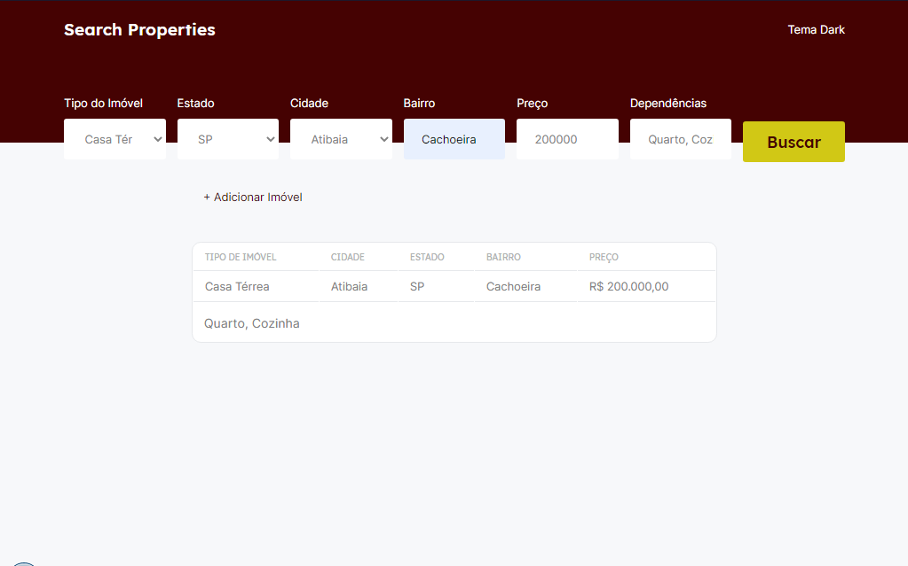

<h1 align="center">
  Search Properties
</h1>

  <a href="#-tecnologias">Tecnologias</a>&nbsp;&nbsp;&nbsp;|&nbsp;&nbsp;&nbsp;
  <a href="#-projeto">Projeto</a>&nbsp;&nbsp;&nbsp;|&nbsp;&nbsp;&nbsp;
  <a href="#-como-começar">Como Começar</a>&nbsp;&nbsp;&nbsp;|&nbsp;&nbsp;&nbsp;
  <a href="#-como-contribuir">Como Contribuir</a>&nbsp;&nbsp;&nbsp;|&nbsp;&nbsp;&nbsp;
  <a href="#memo-licença">Licença</a>

---
<h2 align="center">

  
</h2>

 

  

 

  

## 🚀 Tecnologias

Esse projeto foi desenvolvido com as seguintes tecnologias:

- [ReactJS](https://reactjs.org/)
- [Next.js](https://nextjs.org/)
- [Sass](https://sass-lang.com/)
- [TypeScript](https://www.typescriptlang.org/)

## 💻 Projeto

Search Properties é o app de pesquisar imóveis

## 🔥 Como Começar
- 1 - Clone esse repositório: `git clone https://github.com/pedroduarte2005/app-search-properties.git`;
- 2 - Entre na pasta: `cd app-search-properties`;~
- 3 - Vá no backend: `cd backend`
- 4 - Instale as dependências: `yarn` ou `npm install`;
- 5 - Rode o servidor: `yarn dev` ou `npm run dev`;
- 6 - Vá no frontend: `cd frontend`;
- 7 - Instale as dependências: `yarn` ou `npm install`;
- 8 - Rode o frontend: `yarn dev` e depois acesse nesse endereço `http://localhost:3000`;

## ⚡️ Como contribuir

- Faça um fork desse repositório;
- Cria uma branch com a sua feature: `git checkout -b minha-feature`;
- Faça commit das suas alterações: `git commit -m 'feat: Minha nova feature'`;
- Faça push para a sua branch: `git push origin minha-feature`.

Depois que o merge da sua pull request for feito, você pode deletar a sua branch.

## :memo: Licença

Esse projeto está sob a licença MIT. Veja o arquivo [LICENSE](LICENSE.md) para mais detalhes.

---

Feito com ♥ by Pedro Duarte :wave: